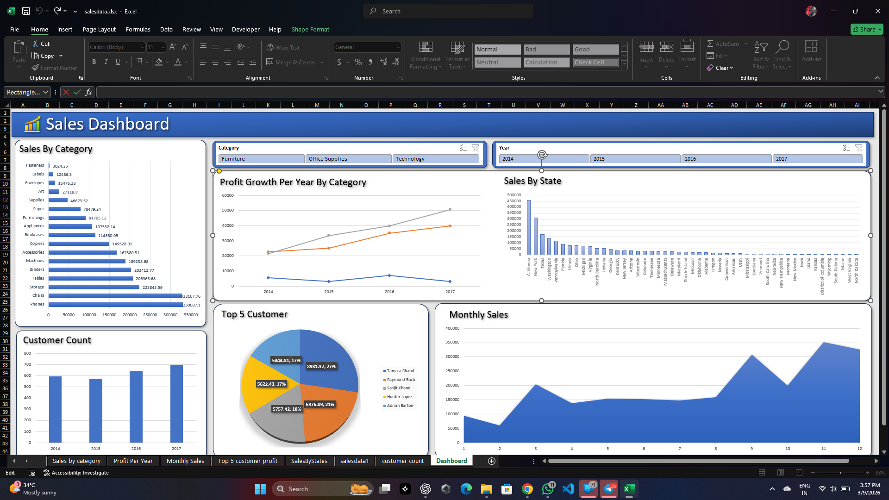

# Sales Data Analysis (Excel Dashboard)

This project analyzes sales data to identify revenue trends and key business insights using an Excel dashboard.

## Tools Used
- Microsoft Excel
- Pivot Tables
- Pivot Charts
- Data Visualization

## Dashboard Preview

## Key Insights

- Phones generate the highest sales revenue among all product categories.
- Sales increased steadily between 2014 and 2017.
- California and New York generate the highest sales.
- Sales peak toward the end of the year.
- A small group of customers contributes a large portion of total revenue.

## Files in This Project

- `salesdata.xlsx` → Raw dataset
- `Excel-Sales-Analysis.mp4` → Dashboard walkthrough
- `Dashboard.png` → Dashboard preview

Download the video file `Excel-Sales-Analysis.mp4` to see the interactive dashboard.
